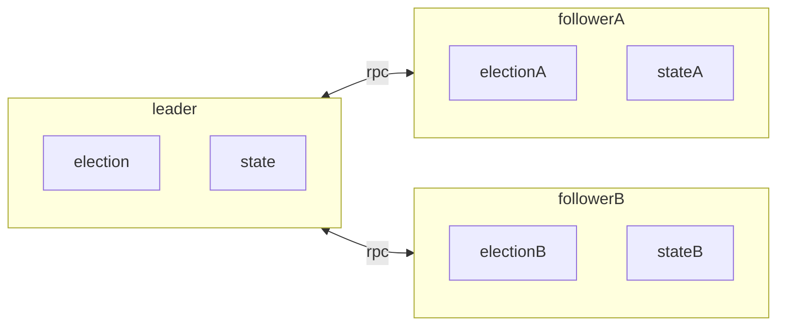

## What
beacon是一个分布式key-value系统。
## How
基于raft共识算法，实现一致性读写的分布式key-value系统。raft算法主要包括：
1. leader选举模块
2. 日志复制模块（TODO）

```mermaid
  flowchart LR
  subgraph followerA
    electionA
    stateA
  end
  subgraph followerB
    electionB
    stateB
  end
  subgraph leader
    election
    state
  end
  leader <-->|rpc| followerA
  leader <-->|rpc| followerB
```
key-value模块（TODO）
持久化模块（TODO）

